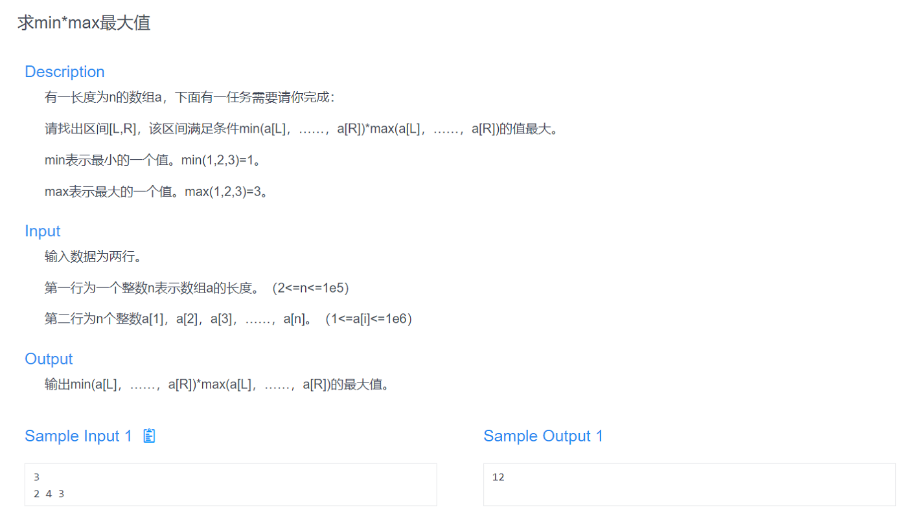
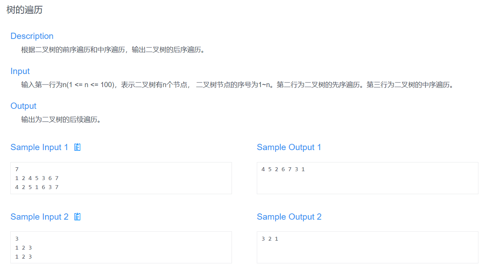
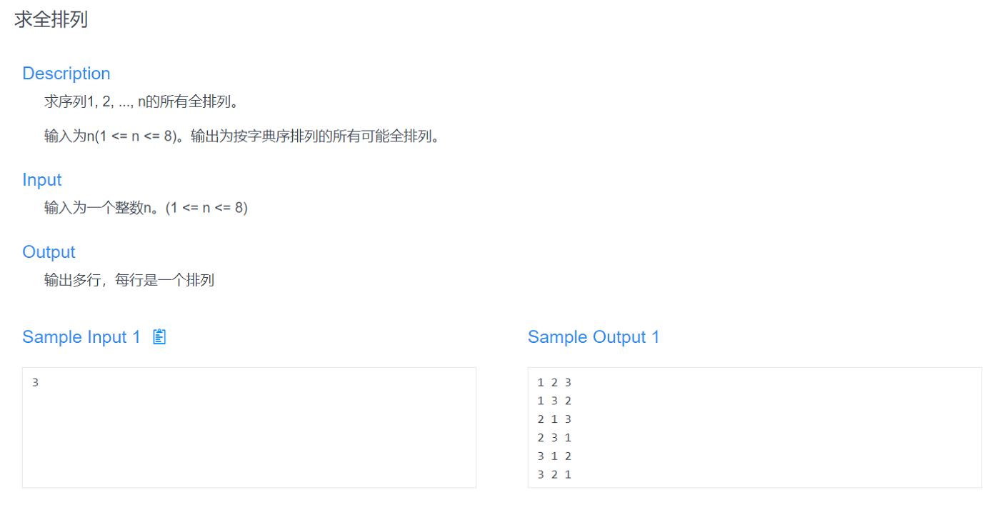
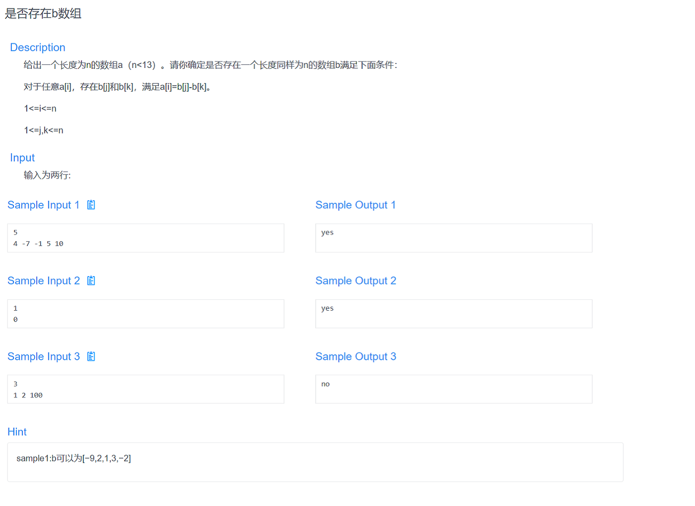

# 华东师范大学数据学院预推免机试题解

## T1 求min\*max的最大值



暴力稍微注意一些细节就能过。

```cpp
#include <iostream>

using namespace std;

int nums[100010];

int main() {
    int n;
    cin >> n;
    for (int i = 1; i <= n; i++) {
        cin >> nums[i];
    }
    long long minNum, maxNum, result = 0;
    for (int i = 1; i < n; i++) {
        minNum = nums[i];
        maxNum = nums[i];
        for (int j = i+1; j <= n; j++) {
            if (nums[j] > maxNum) {
                maxNum = nums[j];
            } else if (nums[j] < minNum) {
                minNum = nums[j];
            }
            if (minNum * maxNum > result) {
                result = minNum * maxNum;
            }
        }
    }
    cout << result;
    return 0;
}
```

## T2 树的遍历



该题有专门的解法，恕我不会，我只能暴力建树、递归遍历。

用不惯C++的STL，所以还是回归Java来写的题。

```java
import java.util.*;

public class Main {

    private static class Node {
        int val;
        Node left, right;
        public Node() {}
        public Node(int val) {
            this.val = val;
        }
    }

    private static StringBuilder result = new StringBuilder();

    private static void build(List<Integer> preList, List<Integer> inList, Node root) {
        if (preList.isEmpty()) {
            return;
        }
        int val = root.val;
        int index = inList.indexOf(val);
        if (index > 0) {
            List<Integer> leftPreList = preList.subList(1, index+1);
            List<Integer> leftInList = inList.subList(0, index);
            Node left = new Node(leftPreList.get(0));
            root.left = left;
            build(leftPreList, leftInList, left);
        }
        int size = preList.size();
        if (index < size-1) {
            List<Integer> rightPreList = preList.subList(index+1, size);
            List<Integer> rightInList = inList.subList(index+1, size);
            Node right = new Node(rightPreList.get(0));
            root.right = right;
            build(rightPreList, rightInList, right);
        }
    }

    private static void postOrder(Node root) {
        if (root == null) {
            return;
        }
        postOrder(root.left);
        postOrder(root.right);
        result.append(root.val).append(' ');
    }

    public static void main(String[] args) {
        Scanner sc = new Scanner(System.in);
        int n = sc.nextInt();
        List<Integer> preList = new ArrayList<>();
        List<Integer> inList = new ArrayList<>();
        for (int i = 0; i < n; i++) {
            preList.add(sc.nextInt());
        }
        for (int i = 0; i < n; i++) {
           inList.add(sc.nextInt());
        }
        sc.close();
        Node root = new Node(preList.get(0));
        build(preList, inList, root);
        postOrder(root);
        System.out.println(result.toString().trim());
    }

}
```

## T3 求全排列



这题有很多解法，比较省事的就是STL里的`next_permutation()`。

```cpp
#include <iostream>
#include <algorithm>

using namespace std;

int a[10];

int main() {
    int n;
    cin >> n;
    for (int i = 0; i < n; i++) {
        a[i] = i+1;
    }
    do {
        for (int i = 0; i < n; i++) {
            cout << a[i] << " ";
        }
        cout << endl;
    } while (next_permutation(a, a+n));
    return 0;
}
```

## T4 是否存在b数组



考试的时候考虑到题目单输出，且不限制提交次数，所以可以暴力试样例，十个蒙对了九个，时间够的话可以十个都蒙出来……

```cpp
#include <iostream>

using namespace std;

int a[15];

int main() {
    int n;
    cin >> n;
    for (int i = 0; i < n; i++) {
        cin >> a[i];
        if (a[i] < 0) {
            a[i] = -a[i];
        }
    }
    if (n == 5) {
        cout << "no" << endl;
        return 0;
    }
    if (n == 6) {
        cout << "no" << endl;
        return 0;
    }
    cout << "yes" << endl;
    return 0;
}
```

好啦好啦，看正解，问过ACMer，说这是个NP问题，找不出特别好的办法，所以我写了个暴力，只通过了样例毕竟机考时候没提交过，不知道对不对……

```cpp
#include <iostream>

using namespace std;

int a[15], b[15], n;

bool flag;

void dfs(int cnt) {
    if (flag) {
        return;
    }
    if (cnt == n) {
        for (int i = 0; i < n; i++) {
            for (int j = i+1; j < n; j++) {
                if (b[i] - b[j] == a[n-1] || b[j] - b[i] == a[n-1]) {
                    flag = true;
                }
            }
        }
        return;
    }
    for (int i = 0; i < cnt; i++) {
        b[cnt] = b[i] + a[cnt-1];
        dfs(cnt+1);
        b[cnt] = b[i] - a[cnt-1];
        dfs(cnt+1);
    }
}

int main() {
    cin >> n;
    for (int i = 0; i < n; i++) {
        cin >> a[i];
        if (a[i] < 0) {
            a[i] = -a[i];
        }
    }
    b[0] = 0;
    dfs(1);
    if (flag) {
        cout << "yes" << endl;
    } else {
        cout << "no" << endl;
    }
    return 0;
}
```
